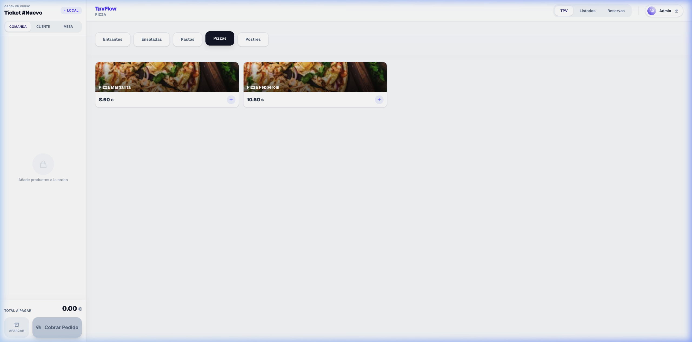
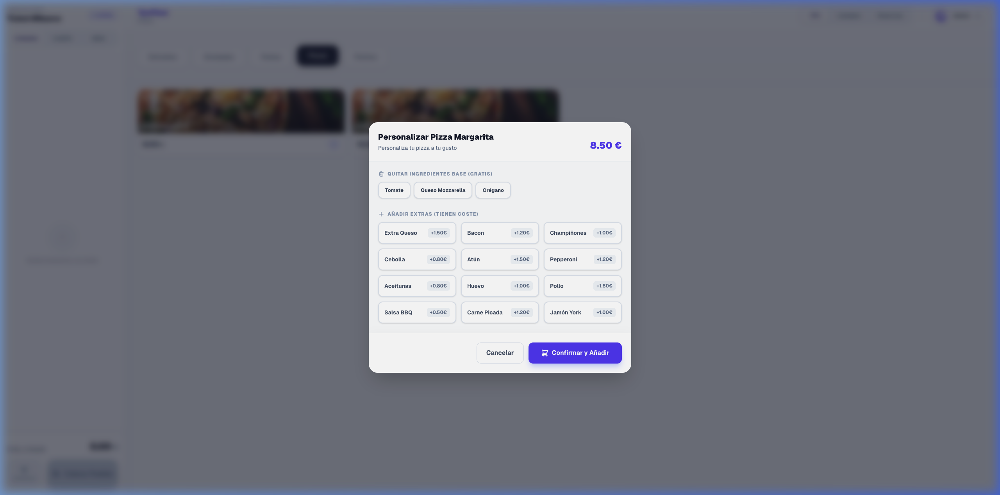
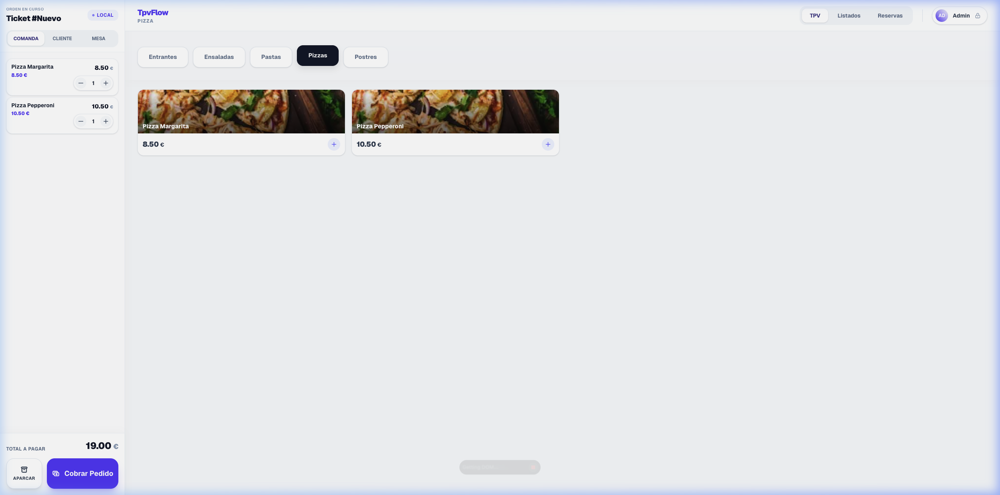
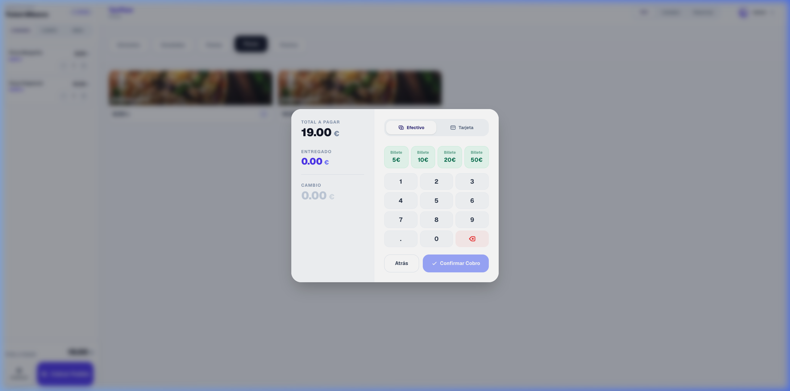
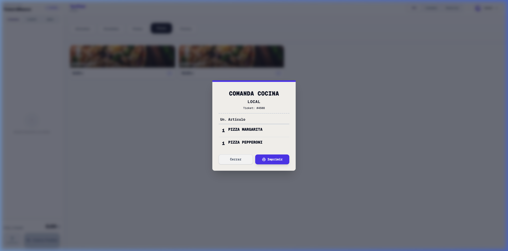
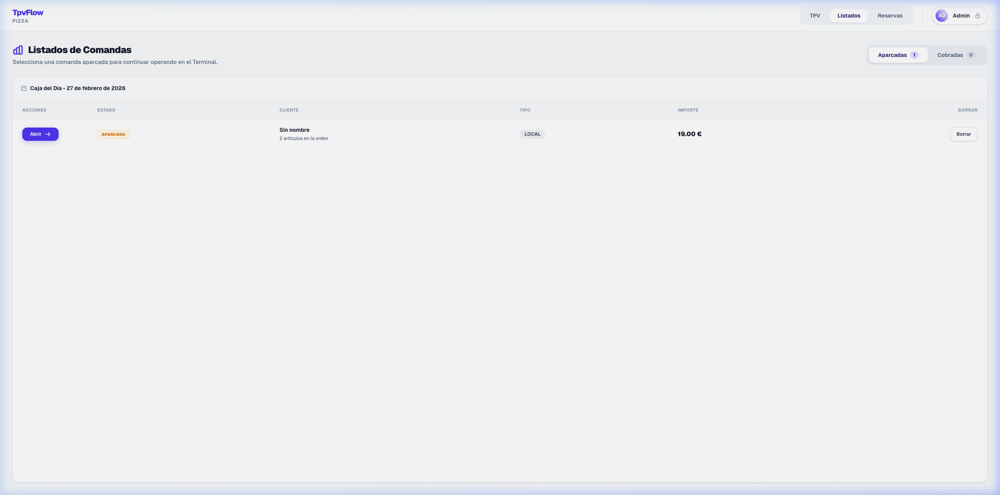

# TpvFlow - Terminal Punto de Venta Inteligente

TpvFlow es una aplicación moderna y robusta para la gestión de puntos de venta (Terminal Punto de Venta), especialmente diseñada para restaurantes, pizzerías y negocios de hostelería. Su arquitectura modular separa el Frontend (basado en Next.js y React) y el Backend (una API REST construida con NestJS).

## Características Principales

*   🚀 **Interfaz Rápida y Fluida**: Panel de TPV optimizado para uso ágil en pantallas táctiles y entornos de ritmo rápido.
*   🍕 **Configurador de Pedidos**: Personalización de pizzas y platos con ingredientes base modulares, cálculos de sobrecostos e ingredientes extra.
*   📅 **Gestión de Reservas y Tickets Aparcados**: Sistema interactivo que permite asentar reservas, convertirlas a tickets "aparcados" cuando el cliente llega al local ("VINO") y realizar cobros parciales o totales.
*   👥 **Control de Empleados**: Inicio de sesión mediante PIN Code (Manager, Cajero, Camarero) asociado a las diferentes acciones del TPV.
*   📱 **Diseño Accesible**: Creado con Tailwind CSS, adaptándose perfectamente a diversos tamaños de pantallas (desktop, tablet, móvil).
*   🌐 **Arquitectura Monolítica/Modular**: Frontend en Next.js (TypeScript) + Backend en NestJS, comunicados mediante una REST API.
*   💾 **Fácil de desplegar**: Listo para funcionar localmente o con entornos de orquestación en la nube como Vercel y Dokploy.
*   � **Demo en Vivo**: Puedes probar la aplicación en [tpvflow.vercel.app](https://tpvflow.vercel.app).
    *   **Usuario**: Admin
    *   **PIN**: 1234
## Galería Visual (Capturas Reales)

### 1. Panel Principal del TPV
La interfaz está optimizada para la agilidad en el punto de venta.


### 2. Configuración de Pizzas
Personalización modular de ingredientes con impacto en el precio.


### 3. Pedido en Curso
Panel lateral con el resumen detallado de la comanda.


### 4. Interfaz de Cobro
Proceso de pago rápido con teclado numérico integrado.


### 5. Ticket de Cocina
Formato compacto listo para comandas de cocina.


### 6. Listado de Comandas
Gestión de comandas aparcadas y cobradas.


## Estructura del Proyecto

El repositorio está dividido en dos principales directorios:

### `/frontend` (Next.js 14)
*   **Next.js (App Router)** para un enrutado intuitivo y generación de layouts estáticos/dinámicos (`/tpv`, `/listados`, `/reservas`).
*   **Context/Hooks**: Mantenemos el carrito, los clientes y la sesión separados con Custom Hooks (`useCart`, `useCustomers`) para facilitar la prueba de unit testing.
*   **Tailwind CSS** para un modelado premium y limpio.

### `/backend` (NestJS)
*   Back-end robusto manejado con **NestJS** en TypeScript.
*   Conexión a base de datos **PostgreSQL** mediante **Prisma ORM**.
*   Organizado en módulos (`Products`, `Categories`, `Customers`, `Orders`, `Employees`).
*   Migración de almacenamiento temporal a una fuente única de verdad en base de datos transaccional, asegurando total sincronización en el cobro, configuración de pizzas y listados.

## Instalación y Arranque Rápido

### Requisitos
*   Node.js (v18+)
*   NPM o predeterminado

### Pasos

1. Clona el repositorio:
   ```bash
   git clone https://github.com/rmenor/tpvflow.git
   cd tpvflow
   ```

2. Arranca el **Backend** (NestJS):
   ```bash
   cd backend
   npm install
   npm run start:dev
   ```
   Estará disponible en `http://localhost:3001` (por defecto habilitado para CORS).

3. En otra terminal, inicializa el **Frontend** (Next.js):
   ```bash
   cd frontend
   npm install
   npm run dev
   ```
   Abre [http://localhost:3000](http://localhost:3000) en tu navegador.

## Roadmap & Futuro

*   [x] Integrar base de datos JSON en el Backend como fuente de verdad.
*   [x] Generación de Modales de cobro interactivos (Efectivo y Tarjeta).
*   [x] Conexión base de datos real (PostgreSQL / MongoDB) con Prisma u ORM.
*   [x] Sincronización en tiempo real del Dashboard (Estadísticas e Informes) y flujos del carrito (TPV).
*   [ ] Impresión de tickets configurables mediante escPOS directamente a la red.

---
*⌨️ TpvFlow está diseñado por el equipo de ingeniería para optimizar los flujos de la hostelería.*
